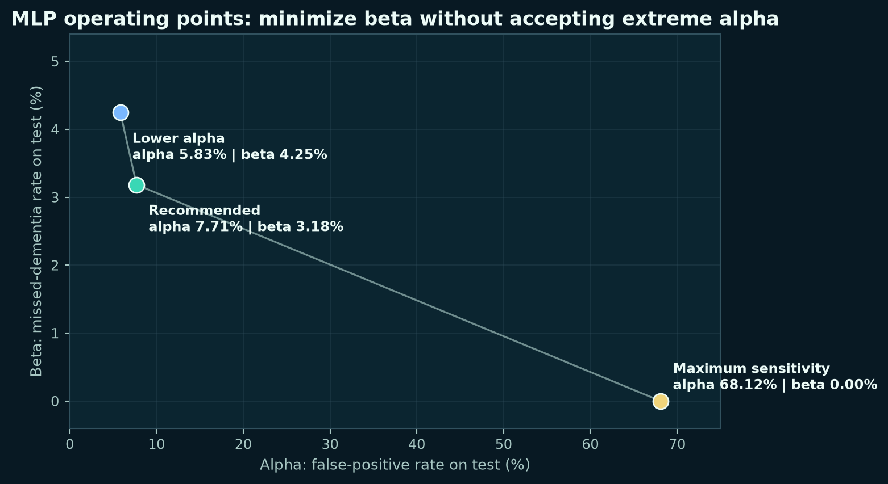
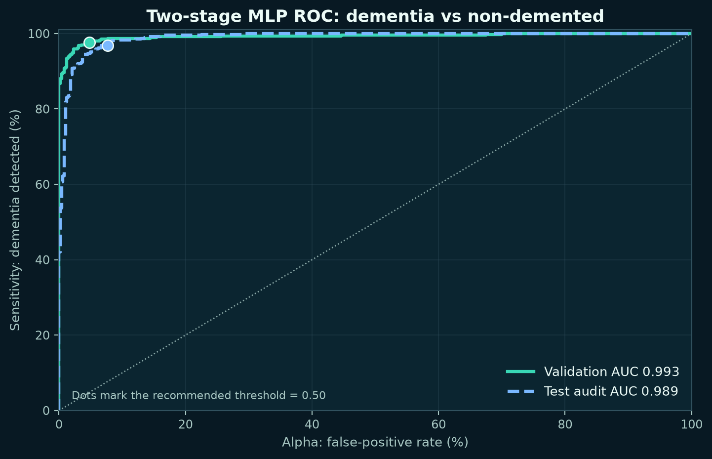
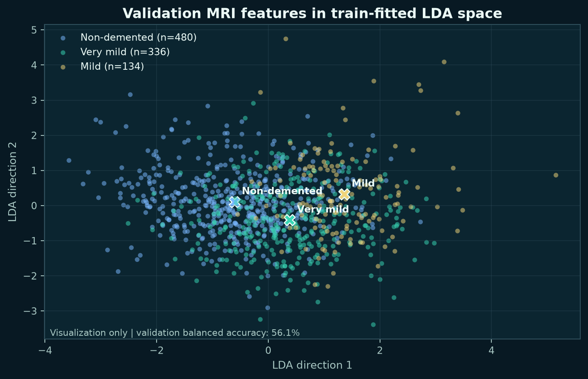
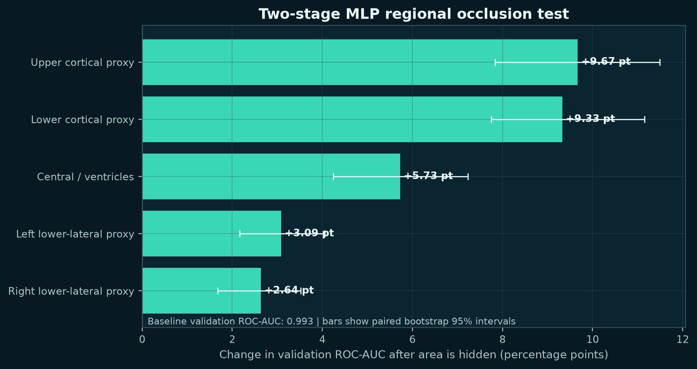

# Results and Interpretation

## Recommended MLP Operating Point

Threshold: `0.50`.

| Metric | Validation | Test audit |
| --- | ---: | ---: |
| Alpha | 4.79% | 7.71% |
| Beta | 2.34% | 3.18% |
| Sensitivity | 97.66% | 96.82% |
| Specificity | 95.21% | 92.29% |
| False alarms | 23 | 37 |
| Missed dementia | 11 | 15 |

The test confusion matrix is:

| | Predicted non-demented | Predicted dementia |
| --- | ---: | ---: |
| Actual non-demented | 443 | 37 |
| Actual dementia | 15 | 456 |

## Threshold Tradeoff

| Operating point | Threshold | Test alpha | Test beta | Decision |
| --- | ---: | ---: | ---: | --- |
| Maximum sensitivity | 0.000006 | 68.13% | 0.00% | Rejected: flags most non-demented images. |
| Recommended | 0.500 | 7.71% | 3.18% | Lowest beta with single-digit alpha. |
| Lower alpha | 0.748 | 5.83% | 4.25% | Reasonable alternative if false alarms cost more. |

Moving from `0.50` to `0.748` removes nine false alarms but adds five missed dementia images. Because missed dementia is the primary error, the project recommends `0.50`.

## ROC-AUC

The dementia detector achieved:

- Validation ROC-AUC: 0.993.
- Test-audit ROC-AUC: 0.989.

$$
\mathrm{AUC}
=
\Pr(\text{score for dementia image} > \text{score for non-demented image}).
$$

High AUC indicates strong ranking, not a complete operating decision. Alpha and beta still depend on the selected threshold.

## LDA Diagnostic

The train-fitted LDA visualization gives 56.1% balanced accuracy on validation. Non-demented, very-mild, and mild points overlap substantially. This supports using a nonlinear MLP boundary, but it is not evidence that the displayed two-dimensional projection contains all predictive information.

## Regional Occlusion

The two-stage MLP's validation ROC-AUC before occlusion was 0.993.

| Coarse region hidden | ROC-AUC decrease |
| --- | ---: |
| Upper cortical proxy | 9.67 points |
| Lower cortical proxy | 9.33 points |
| Central / ventricles | 5.73 points |
| Left lower-lateral proxy | 3.09 points |
| Right lower-lateral proxy | 2.64 points |

Broad cortical regions produced the largest measured performance changes, followed by the central/ventricle region. These areas are overlapping rectangles, not segmented anatomy. The result means the fitted model was sensitive to those image patches; it does not prove where Alzheimer pathology is located.

## Evidence Files

- `results/tables/mlp-thresholds/constraint_comparison.csv`
- `results/tables/mlp-thresholds/threshold_sweep_*.csv`
- `results/tables/mlp-thresholds/*confusion_matrix*.csv`
- `results/tables/interpretation/lda_validation_projection.csv`
- `results/tables/interpretation/mlp_regional_occlusion.csv`
- `results/tables/deterministic-baseline/model_summary.csv`
